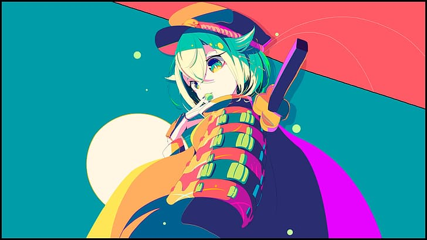

# Anime Palette Analyzer

A Python tool that extracts the 5 dominant colors from anime images and visualizes them with hex codes and percentages.

## Features

- Extracts dominant colors using K-means clustering
- Shows color distribution with percentages
- Displays hex codes for each color
- Generates clean matplotlib visualizations
- Modular, well-organized code

## Demo


*Extracted color palette with hex codes and percentages*




*Example anime image used for analysis*

## Installation
```bash
git clone https://github.com/Evastrings/anime-palette-analyzer.git
cd anime-palette-analyzer
pip install -r requirements.txt
```

## Usage
```python
python3 main.py
```

The tool will process the anime image and generate:
- Color extraction data
- Visual palette with percentages and hex codes
- Output saved to `/output` directory

## Tech Stack

- Python
- NumPy (numerical operations)
- scikit-learn (K-means clustering)
- Matplotlib (visualization)
- Pillow (image processing)

## Use Cases

- **Designers**: Extract color palettes from anime art for projects
- **Artists**: Analyze color composition in reference images
- **Developers**: Integrate color extraction into creative tools

## Project Structure
```
├── color_extractor.py       # Color extraction logic
├── color_data.py           # Data handling
├── palette_generator.py    # Palette generation
├── visualize_palette.py    # Visualization
├── main.py                 # Entry point
└── requirements.txt        # Dependencies
