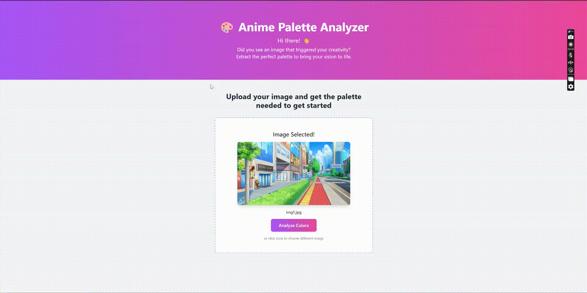
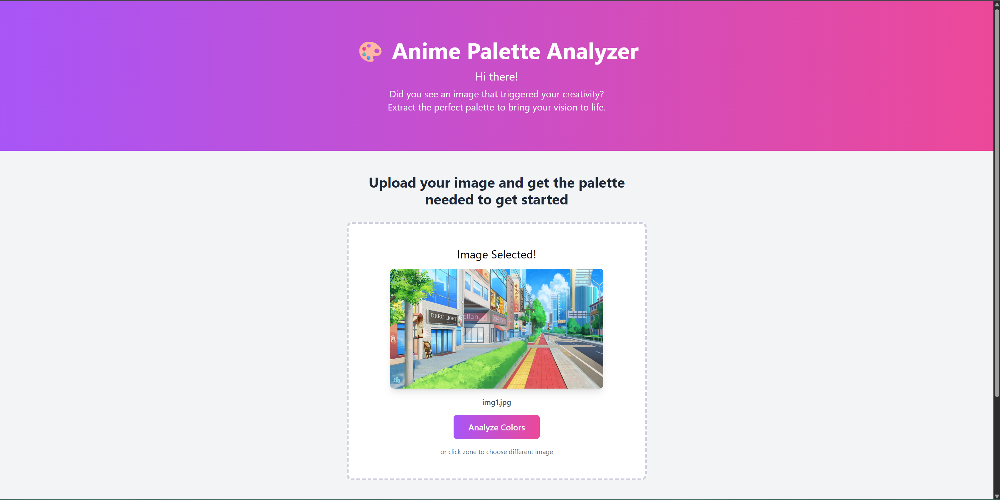
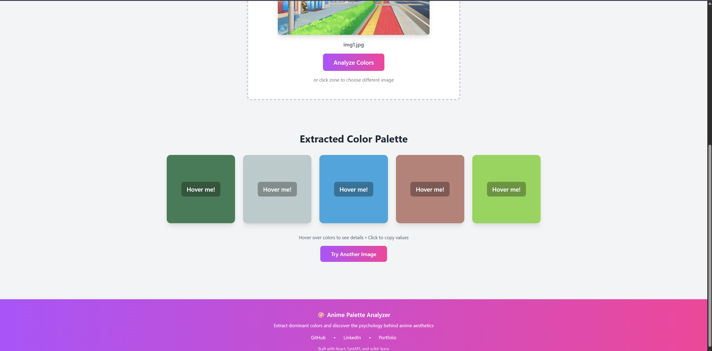
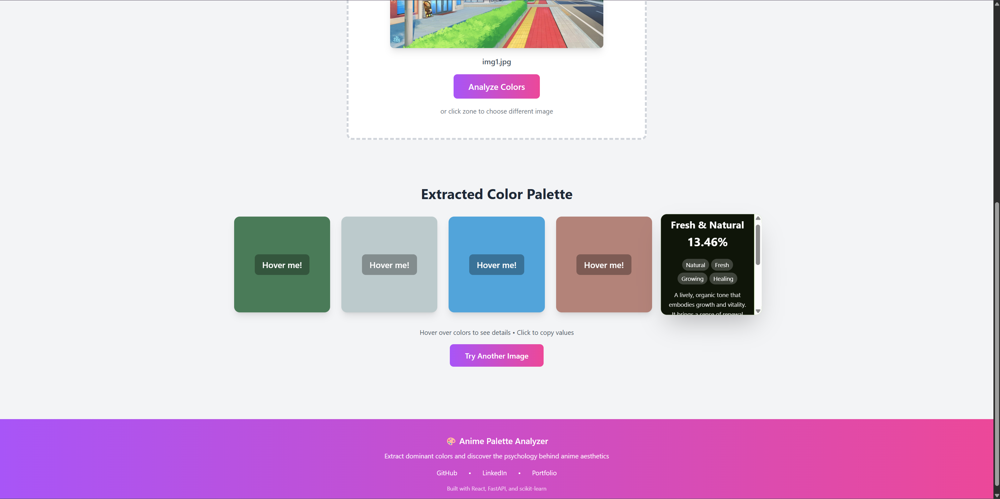

# 🎨 Anime Palette Analyzer

> Extract dominant colors from anime images and discover the psychological meaning behind every hue.

[](YOUR_VERCEL_URL)
[](YOUR_RAILWAY_URL)

[**🚀 Live Demo**](https://anime-palette-analyzer.vercel.app/)

---

## ✨ Features

- **🎨 Color Extraction** - Upload any anime image and extract the 5 most dominant colors using K-means clustering
- **🧠 Psychological Analysis** - Get detailed insights on the mood, emotions, and symbolism of each color
- **📋 Copy to Clipboard** - Instantly copy HEX or RGB values for your design projects
- **🖼️ Drag & Drop Upload** - Seamless file upload experience with image preview
- **📱 Responsive Design** - Beautiful UI that works on any device
- **⚡ Real-time Processing** - Fast color analysis powered by scikit-learn

---

## 🎬 Demo



### Screenshots

| Upload Screen | Color Analysis | Psychology Insights |
|--------------|----------------|---------------------|
|  |  |  |

---

## 🛠️ Tech Stack

### Frontend
- **React 18** - Modern UI library
- **Vite** - Lightning-fast build tool
- **Tailwind CSS** - Utility-first styling
- **JavaScript (ES6+)** - Modern JavaScript features

### Backend
- **FastAPI** - High-performance Python web framework
- **scikit-learn** - K-means clustering for color extraction
- **Pillow (PIL)** - Image processing
- **NumPy** - Numerical computations
- **Uvicorn** - ASGI server

### Deployment
- **Vercel** - Frontend hosting with edge network
- **Railway** - Backend hosting with auto-scaling

---

## 🧠 How It Works

### 1. Color Extraction Algorithm
```python
# K-means clustering groups similar pixels
1. Load and resize image (optimization)
2. Convert image to RGB array
3. Apply K-means clustering (k=5)
4. Extract cluster centers as dominant colors
5. Calculate color percentages based on pixel distribution
```

### 2. Psychological Analysis
The app analyzes each color using:
- **HSL Color Space** - Determines hue, saturation, lightness
- **Color Psychology Database** - Maps colors to emotions and meanings
- **Contextual Analysis** - Provides anime-specific usage insights

### 3. API Architecture
```
Frontend (React)  →  POST /api/analyze  →  Backend (FastAPI)
                                           ↓
                                    K-means Clustering
                                           ↓
                                    Color Psychology
                                           ↓
Frontend  ←  JSON Response  ←  {colors, percentages, analysis}
```

---

## 🚀 Getting Started

### Prerequisites
- Node.js 18+
- Python 3.11+
- npm or yarn

### Local Development

#### Backend Setup
```bash
# Navigate to backend
cd backend

# Create virtual environment
python -m venv venv
source venv/bin/activate  # On Windows: venv\Scripts\activate

# Install dependencies
pip install -r requirements.txt

# Run server
uvicorn app.main:app --reload
```

Server runs at `http://localhost:8000`

#### Frontend Setup
```bash
# Navigate to frontend
cd frontend

# Install dependencies
npm install

# Start dev server
npm run dev
```

App runs at `http://localhost:5173`

---

## 📂 Project Structure
```
anime-palette-analyzer/
├── frontend/
│   ├── src/
│   │   ├── components/
│   │   │   ├── Hero.jsx
│   │   │   ├── UploadZone.jsx
│   │   │   ├── ColorGrid.jsx
│   │   │   ├── ColorCard.jsx
│   │   │   └── Footer.jsx
│   │   ├── utils/
│   │   │   └── colorPsychology.js
│   │   ├── App.jsx
│   │   └── main.jsx
│   └── package.json
├── backend/
│   ├── app/
│   │   ├── main.py
│   │   └── services/
│   │       ├── color_extractor.py
│   │       └── color_data.py
│   └── requirements.txt
└── README.md
```

---

## 🎯 API Reference

### `POST /api/analyze`

Extract colors from an uploaded image.

**Request:**
- Method: `POST`
- Content-Type: `multipart/form-data`
- Body: `file` (image file)

**Response:**
```json
{
  "d_colors": [
    {
      "hex": "#049aa5",
      "rgb": [4, 154, 165],
      "percentage": 46.89
    },
    {
      "hex": "#e9e7bb",
      "rgb": [233, 231, 187],
      "percentage": 10.53
    }
  ]
}
```

---

## 🎨 Use Cases

- **Designers** - Extract color palettes from anime art for creative projects
- **Artists** - Analyze color composition in reference images
- **Developers** - Integrate color extraction into creative tools
- **Anime Fans** - Discover the psychology behind favorite anime aesthetics

---

## 🚧 Future Enhancements

- [ ] **Demo Carousel** - Pre-loaded examples from popular anime
- [ ] **Palette Export** - Download as ASE, JSON, or PNG
- [ ] **Genre Classification** - ML model to detect anime genre from colors
- [ ] **Studio Comparison** - Compare color palettes across anime studios
- [ ] **Community Gallery** - Share and rate user-submitted palettes
- [ ] **Color Harmony Analysis** - Complementary, triadic, analogous schemes

---

## 💡 What I Learned

- **Full-Stack Architecture** - Connecting React frontend with FastAPI backend
- **Computer Vision** - Implementing K-means clustering for image analysis
- **API Design** - Building RESTful endpoints with proper error handling
- **Deployment** - Configuring CORS, environment variables, and production builds
- **UX Design** - Creating intuitive drag-and-drop interactions

---

## 🤝 Contributing

Contributions are welcome! Feel free to:
- 🐛 Report bugs
- 💡 Suggest new features
- 🔧 Submit pull requests

---

## 📜 License

MIT License - feel free to use this project for learning or building upon!

---

## 👤 Author

**Elijah**

- 🌐 Portfolio: [https://x.com/hxdlab]
- 💼 LinkedIn: [https://ng.linkedin.com/in/elijahakande]
- 🐙 GitHub: [@Evastrings](https://github.com/Evastrings)
- 📧 Email: elijahferanmikun@gmail.com

---

## 🙏 Acknowledgments

- Color psychology research from anime art communities
- Inspiration from Studio Ghibli and Kyoto Animation's color work
- Built with ❤️ for the anime and design communities

---

<p align="center">Made with 🎨 and ☕</p>